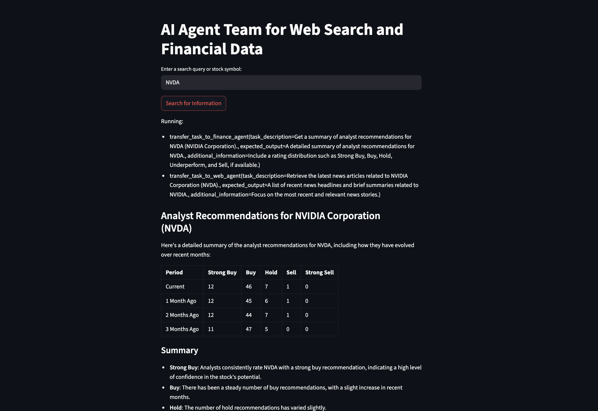
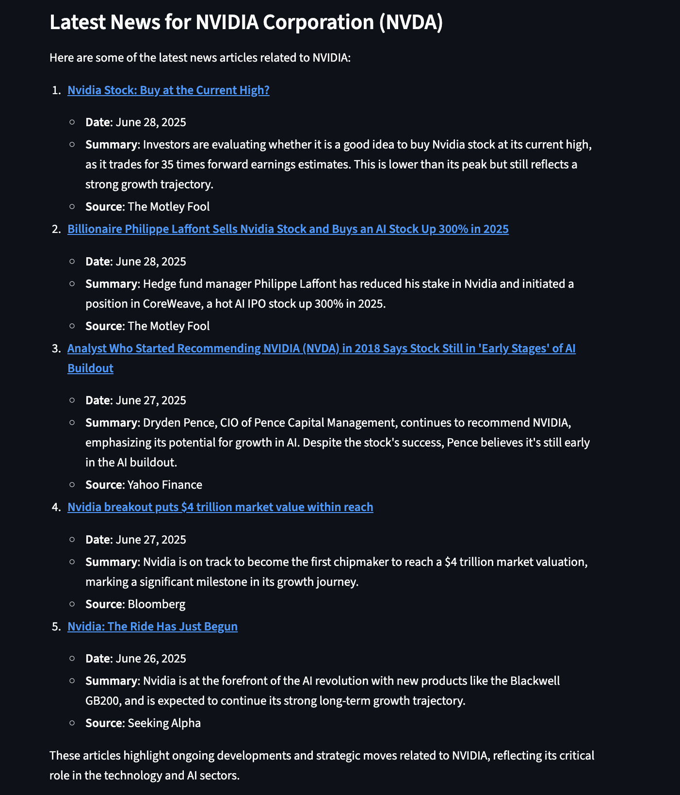

# 💰 AI Finance Agent Team

> **Advanced financial intelligence powered by GPT-4, Yahoo Finance, and web search capabilities**

[](https://python.org)
[](https://streamlit.io)
[](https://openai.com)
[](https://finance.yahoo.com)
[](https://opensource.org/licenses/MIT)

## 🚀 What is this?

A sophisticated **AI Agent Team** that combines multiple specialized agents to provide comprehensive financial analysis. The system integrates **real-time financial data** from Yahoo Finance with **web search capabilities** to deliver complete market intelligence powered by OpenAI's GPT-4.

## ✨ Features

- 🤖 **Multi-Agent Architecture**: Specialized Web and Finance agents working together
- 📊 **Real-time Financial Data**: Stock prices, analyst recommendations, and company information
- 🔍 **Intelligent Web Search**: Latest financial news and market updates
- 📈 **Analyst Recommendations**: Professional investment insights and ratings
- 📋 **Structured Data Display**: Beautiful tables and formatted financial reports
- 🎨 **Interactive Web Interface**: Professional Streamlit dashboard
- 🔄 **Team Coordination**: Agents collaborate to provide comprehensive analysis
- 📚 **Source Attribution**: All information includes reliable sources

## 🎯 Use Cases

- **Investment Research**: Complete analysis of stocks with recommendations and news
- **Portfolio Management**: Track multiple securities with real-time data
- **Market Intelligence**: Stay updated with latest financial trends and news
- **Financial Planning**: Access comprehensive company and market information
- **Risk Assessment**: Analyst recommendations and market sentiment analysis
- **Trading Support**: Real-time price data and technical analysis

## 🛠️ Installation

1. **Clone the repository**
   ```bash
   git clone <repository-url>
   cd "Finance Agent"
   ```

2. **Install dependencies**
   ```bash
   pip install phi-ai streamlit openai python-dotenv yfinance
   ```

3. **Set up environment variables**
   Create a `.env` file in the project root:
   ```env
   OPENAI_API_KEY=your_openai_api_key_here
   ```

## 🚀 Quick Start

### Option 1: Command Line Interface
```bash
python finance_web_agent.py
```

### Option 2: Interactive Web Dashboard
```bash
streamlit run streamlit_finance_web_agent.py
```

## 📝 Example Usage

```python
from phi.agent import Agent
from phi.model.openai import OpenAIChat
from phi.tools.duckduckgo import DuckDuckGo
from phi.tools.yfinance import YFinanceTools

# Create specialized agents
web_agent = Agent(
    name="Web Agent",
    role="Search the web for information",
    model=OpenAIChat(id="gpt-4o"),
    tools=[DuckDuckGo()],
    instructions=["Always include sources"]
)

finance_agent = Agent(
    name="Finance Agent",
    role="Get financial data",
    model=OpenAIChat(id="gpt-4o"),
    tools=[YFinanceTools(stock_price=True, analyst_recommendations=True, company_info=True)],
    instructions=["Use tables to display data"]
)

# Create agent team
agent_team = Agent(
    team=[web_agent, finance_agent],
    instructions=["Always include sources", "Use tables to display data"]
)

# Get comprehensive analysis
response = agent_team.run("Summarize analyst recommendations and share the latest news for NVDA")
print(response.content)
```

## 📸 Screenshots


*Professional Streamlit interface for financial queries*


*Comprehensive financial analysis with data tables*


*Real-time market data and news integration*

## 🏗️ Architecture

```
🏛️ Agent Team Architecture
├── 🔍 Web Agent
│   ├── DuckDuckGo Search
│   ├── Latest News Retrieval
│   └── Market Sentiment Analysis
├── 💹 Finance Agent
│   ├── Yahoo Finance Integration
│   ├── Stock Price Data
│   ├── Analyst Recommendations
│   └── Company Information
└── 🤝 Team Coordination
    ├── Data Synthesis
    ├── Source Attribution
    └── Formatted Reporting
```

## 📁 Project Structure

```
📦 Finance Agent/
├── 💰 finance_web_agent.py         # Command-line multi-agent system
├── 🎨 streamlit_finance_web_agent.py # Interactive web dashboard
├── 🖼️ Output-1.png                 # Dashboard screenshot
├── 🖼️ Output-2.png                 # Analysis example
├── 🖼️ Output-3.png                 # Market data display
└── 📖 README.md                    # This file
```

## 🎛️ Agent Capabilities

### 🔍 **Web Agent**
- Real-time news search
- Market sentiment analysis
- Company press releases
- Financial blog monitoring
- Social media trends

### 💹 **Finance Agent**
- Current stock prices
- Historical price data
- Analyst recommendations
- Company fundamentals
- Financial ratios
- Earnings reports

### 🤝 **Team Coordination**
- Intelligent query routing
- Data cross-referencing
- Comprehensive reporting
- Source validation
- Conflict resolution

## 🔧 Configuration Options

Customize the agents for specific needs:

```python
# Enhanced Finance Agent
finance_agent = Agent(
    tools=[YFinanceTools(
        stock_price=True,
        analyst_recommendations=True,
        company_info=True,
        stock_fundamentals=True,
        income_statements=True
    )]
)

# Specialized instructions
agent_team = Agent(
    team=[web_agent, finance_agent],
    instructions=[
        "Always include sources and timestamps",
        "Use tables for numerical data",
        "Highlight key insights",
        "Include risk factors"
    ]
)
```

## 📊 Sample Queries

- "Analyze AAPL stock performance and latest news"
- "Compare MSFT vs GOOGL analyst recommendations"
- "What's the market sentiment for Tesla this week?"
- "Get financial summary for SPY ETF"
- "Latest earnings report for Amazon"

## 🤝 Contributing

We welcome contributions! Areas for enhancement:
- 📈 Additional financial data sources
- 🔮 Predictive analytics features
- 📱 Mobile-responsive interface
- 🔔 Alert and notification systems
- 📊 Advanced charting capabilities

## 📄 License

This project is open source and available under the [MIT License](LICENSE).

## 🙏 Acknowledgments

- [Phi Framework](https://github.com/phidatahq/phidata) - Multi-agent AI framework
- [OpenAI](https://openai.com) - GPT-4 language model
- [Yahoo Finance](https://finance.yahoo.com) - Financial data provider
- [DuckDuckGo](https://duckduckgo.com) - Privacy-focused search
- [Streamlit](https://streamlit.io) - Interactive web applications

---

⭐ **Star this repository if you found it helpful!**

📈 **Ready to revolutionize your financial analysis?** Get started now!